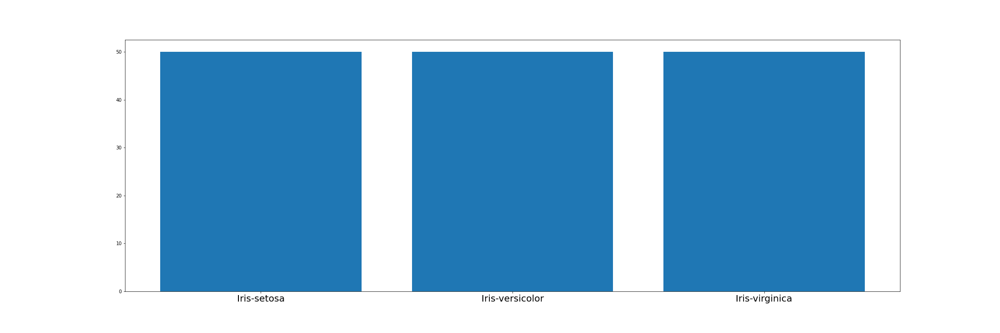
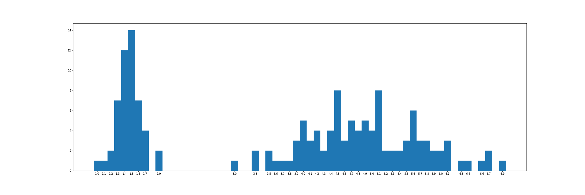
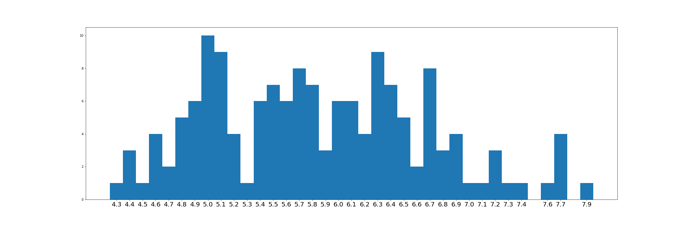
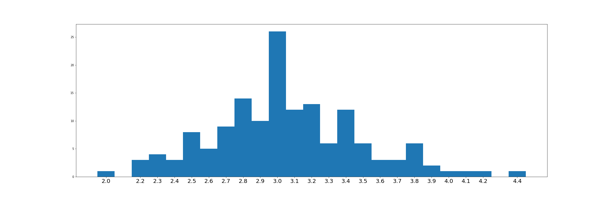

# trabalho_estatistica_MBA

__Participantes:__
- Danúbia Carvalho
- Victor Ciurlino

Este trabalho é uma análise descritiva e estatística da base de dados Isis, dataset bem conhecido e usado para análises simples e treinamento de modelos de classificação.

Foi utilizado a biblioteca Pandas para manipulação e tratamento dos dados e seaborn com matplotlib para a criação de gráficos para análise visual dos dados.

### (1) Calcular a Tabela de Frequência das 5 variáveis separadas:

### (3) Calcular as estatísticas descritivas (Média, Mediana, Moda, Variância, Desvio Padrão, Q(25%), Q(50%), Q(75%), Curtose e Assimetria:

|          	| SepalLengthCm 	| SepalWidthCm 	| PetalLengthCm 	| PetalWidthCm 	|
|---------:	|--------------:	|-------------:	|--------------:	|-------------:	|
|     mode 	|      5.000000 	|     3.000000 	|      1.500000 	|     0.200000 	|
|     mean 	|      5.843333 	|     3.054000 	|      3.758667 	|     1.198667 	|
|   median 	|      5.800000 	|     3.000000 	|      4.350000 	|     1.300000 	|
| kurtosis 	|     -0.552064 	|     0.290781 	|     -1.401921 	|    -1.339754 	|
|     skew 	|      0.314911 	|     0.334053 	|     -0.274464 	|    -0.104997 	|
| variance 	|      0.685694 	|     0.188004 	|      3.113179 	|     0.582414 	|
|      std 	|      0.828066 	|     0.433594 	|      1.764420 	|     0.763161 	|
|      25% 	|      5.100000 	|     2.800000 	|      1.600000 	|     0.300000 	|
|      50% 	|      5.800000 	|     3.000000 	|      4.350000 	|     1.300000 	|
|      75% 	|      6.400000 	|     3.300000 	|      5.100000 	|     1.800000 	|
|      75% 	|           6.4 	|          3.3 	|           5.1 	|          1.8 	|

### (5) Qual a correlação entre as variáveis e o coeficiente de dependência entre elas:

